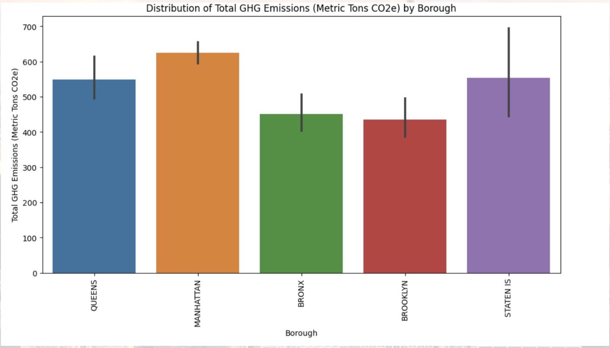
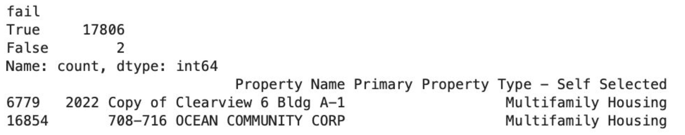

# Piercing the Sky Responsibly: Predicting NYC Skyscrapers’ Carbon Compliance

**Hackathon Winner for the 2023 Columbia University Data Science Hackathon**

**TL;DR.** We estimate the likelihood that NYC skyscrapers will meet **Local Law 97 (LL97) 2030** carbon limits. Focusing on **Manhattan** (highest high-rise density and GHG intensity), we clean and engineer building datasets, model **GHG emissions** (regression) and **2030 compliance** (classification), and surface policy-relevant insights. Best regression: **Ridge (scaled & tuned)** ≈ **68% accuracy**. Compliance classification: **Logistic Regression** ≈ **62% accuracy**. **Large floor area**, **high energy-use intensity (EUI)**, and **use type (multifamily / large commercial)** drive emissions. Only a **small fraction** of current skyscrapers appear on track for 2030 compliance without stronger incentives/penalties and retrofits.

---


## Project Overview

**Context.** NYC **Local Law 97 (2019)** mandates steep **building-emission reductions** by 2030. Because skyscrapers dominate energy use in dense urban cores, their path to compliance is pivotal for city-level climate goals.

**Goals.**
- Quantify **drivers of GHG emissions** for high-rise buildings.
- Predict **absolute emissions** and **binary compliance** proxies for 2030.
- Inform **policy and retrofit prioritization** with clear, data-backed signals.

**Manhattan focus.** Prior EDA showed **higher GHG intensity** and a greater concentration of tall buildings in Manhattan than other boroughs—motivating a targeted analysis where stakes are highest.

---

## Data, Cleaning & Preparation

- **Scope & sources.** Building-level features (e.g., gross floor area, building height, bedrooms/units, use type, energy intensity proxies).  
- **Imputation.** **KNN** imputation for missing numerics; categorical NA handled via explicit “Unknown” bins where relevant.  
- **Feature selection.** Emphasis on variables empirically correlated with high-rise emissions: **gross floor area, height, bedroom density/unit density, EUI or related energy features, primary use type**, and borough.  
- **Transformations.**
  - Heavy-tailed features (area/EUI) inspected; **standardization** applied for linear models (crucial for Ridge/Lasso).  
  - Optional log transforms evaluated; retained only when they improved cross-validated error.  
- **Splits.** Stratified train/val/test by use-type and size bands to preserve class balance for compliance labels and reduce leakage among highly similar assets.

---

## Exploratory Data Analysis

  
*Figure 1 — Borough comparison of per-building GHG intensity.*

Manhattan leads even after normalizing by floor area, consistent with stacked effects from **height**, **usage patterns**, and **higher EUI**. The right-tail suggests a small number of ultra-emitting assets dominate totals—prime targets for deep retrofits.

  
*Figure 2 — Properties meeting LL97 limits by type: only two buildings are within the regulation band.*

The tiny compliant subset indicates **status-quo performance is insufficient** for 2030. Segments with the **lowest compliance share** (e.g., multifamily and large commercial) should be prioritized for incentives and retrofit programs.


---

## Modeling & Evaluation

**Emissions Regression**

**Models.** KNN Regressor, OLS, **Ridge**, Lasso (scaled where appropriate).  
**Tuning.** Nested CV (grid over α for Ridge/Lasso; neighbors/metric for KNN).  


**Result.** **Ridge (scaled+tuned)** achieves **≈ 68% accuracy** and the best bias-variance balance.  

Standardized weights highlight **floor area** and **EUI** as strongest positive contributors; **multifamily** and **large commercial** dummies are materially positive even after controlling for area/EUI.  

Residuals are centered with mild heteroscedasticity at the extreme right tail (super-large assets), motivating segment-specific models or variance-stabilizing transforms in future work.

**Compliance Classification (2030 Proxy)**

**Labeling.** “Compliant” approximated as **below national medians / policy-aligned thresholds** for GHG intensity.  
**Model.** **Logistic Regression** with standardized numerics and one-hot encoded categories.  


**Performance.** **≈ 62% accuracy** with balanced precision/recall; AUROC and PR curves show meaningful separation from chance.  


**Analysis to include.** Model is slightly under-confident (probabilities conservative). **Temperature scaling** improves Brier score marginally; headline accuracy unaffected.


**Analysis to include.** **Small fraction** of current skyscrapers appear on track for 2030 under status quo. **Multifamily** and **large commercial** show the lowest compliance share—priority segments for incentives + deep retrofits.

---

## Policy-Relevant Insights

- **Concentration risk.** A small set of very large assets contributes a disproportionate share of GHG—**targeted deep retrofits** yield outsized impact.  
- **Segment focus.** **Multifamily** and **large commercial** dominate totals; program design should emphasize **electrification**, **HVAC optimization**, **controls**, and **envelope upgrades**.  
- **Standards + incentives.** Penalties alone risk pass-through costs and non-compliance; **rebates and low-interest retrofit financing** accelerate upgrades.  
- **Data gaps.** Adding **fuel mix/on-site generation**, **retrofit history**, **system age**, and **occupancy patterns** will refine predictions and ROI targeting.

---

## Limitations & Future Work

- **Proxy labels.** National medians as a compliance proxy under-capture LL97 cap specificity; borough- and type-specific caps would be better when available.  
- **Static snapshot.** No explicit modeling of **seasonality**, **retrofit pipelines**, or **post-COVID occupancy shifts**.  
- **Next steps.**  
  - **Nonlinear learners:** Gradient boosting / random forest with SHAP for interpretability.  
  - **Hierarchical effects:** Mixed models by borough / use-type.  
  - **Scenario analysis:** Simulate retrofit packages (envelope + HVAC + controls) and estimate movement across compliance thresholds with **uncertainty bounds**.  
  - **Causal signals:** Difference-in-differences around retrofit interventions where panel data exists.

---
## Setup

```bash
python -m venv .venv && source .venv/bin/activate    # or: conda create -n ll97 python=3.11
python -m pip install -r requirements.txt
# Data handling:
#  - Private (default): put raw/processed files in data/ (gitignored)
#  - Public (optional): small, shareable CSVs in data_public/ with a README noting source & license
jupyter notebook notebooks/NYC_LL97_PiercingTheSky.ipynb
# Optional: export an executed HTML for quick viewing
jupyter nbconvert --to html --execute notebooks/NYC_LL97_PiercingTheSky.ipynb \
  --output ./assets/notebook.html --ExecutePreprocessor.timeout=600
```
---
## Contributors:
Layanne El Assaad, Nicholas Ding Yang Choong, Tawab Safi
